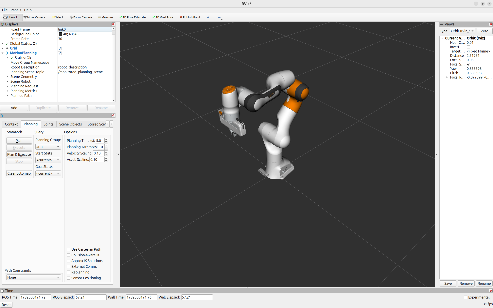
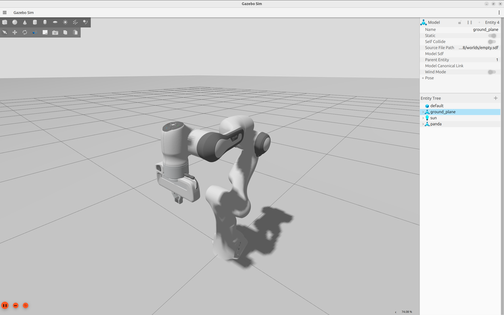
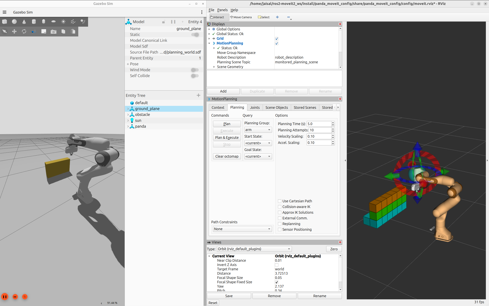
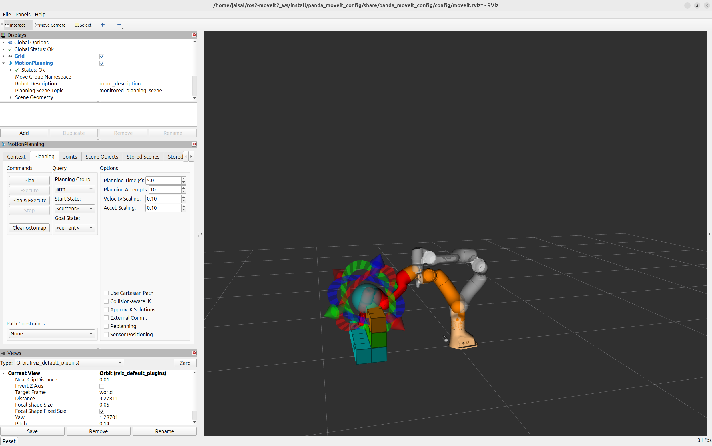
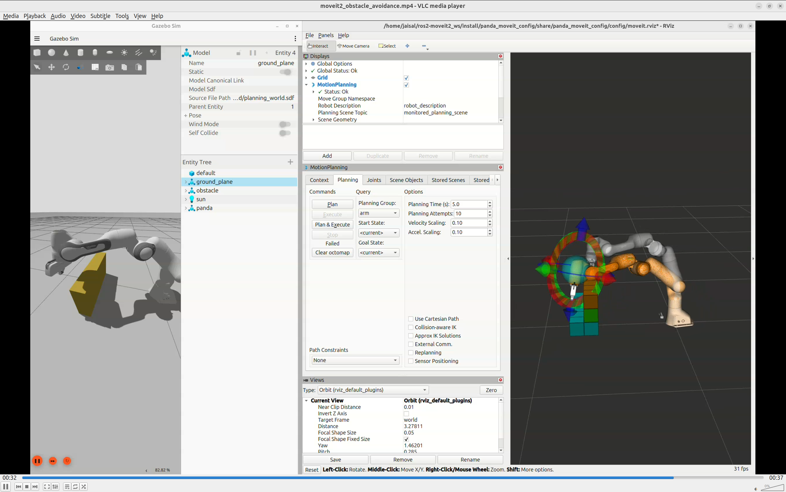
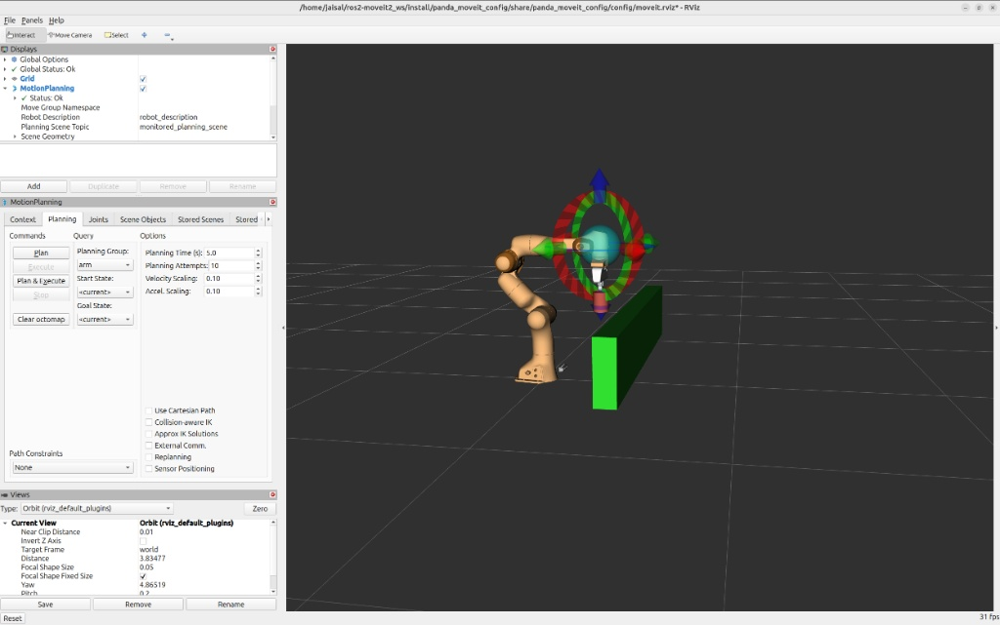
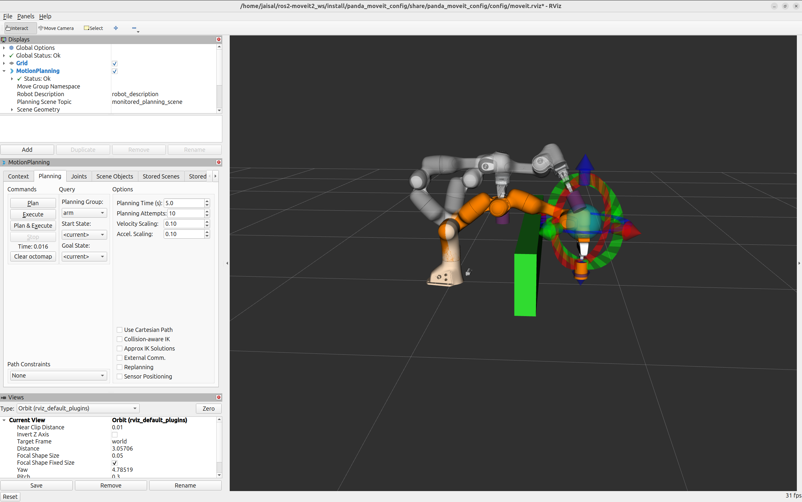

# ROS 2 Manipulation Stack with MoveIt 2 and Franka Panda

A ROS 2 manipulation and motion-planning stack built using **ROS 2 Jazzy**, **MoveIt 2**, **Gazebo Sim**, and **OMPL Motion Planning**.


https://github.com/user-attachments/assets/15c3b7f4-cdee-4130-a43f-f1095333c729


---

## Features

- Motion planning and trajectory execution
- Interactive inverse kinematics
- Collision-aware path generation
- Gazebo-based simulation
- OctoMap occupancy mapping
- Dynamic planning scene manipulation
- Attached collision object handling
- OMPL-based motion planning

---

# Workspace Packages

| Package                | Description                                                                               |
| ---------------------- | ----------------------------------------------------------------------------------------- |
| `panda_description`    | Robot description, URDF/Xacro models, Gazebo worlds, and sensor configuration             |
| `panda_moveit_config`  | MoveIt 2 configuration package, SRDF, controllers, planners, and perception configuration |
| `panda_moveit_control` | Custom C++ applications for planning scene manipulation and obstacle-aware planning       |

---

# Prerequisites

```bash
sudo apt install \
ros-jazzy-moveit \
ros-jazzy-moveit-ros-visualization \
ros-jazzy-ros2-control \
ros-jazzy-ros2-controllers \
ros-jazzy-ros-gz
```

---

# Build

```bash
source /opt/ros/jazzy/setup.bash

colcon build --symlink-install

source install/setup.bash
```

---
# 1. Robot Model and Motion Planning in RViz

Launch the Panda manipulator with MoveIt 2.

```bash
source install/setup.bash

rviz2
```

### Steps to Configure the View:

- Gazebo should be active
- Click the Add button at the bottom of the panel
- Select `MotionPlanning` from the display type list and click OK

### Features

- Interactive Motion Planning plugin
- Forward and Inverse Kinematics
- Goal-state manipulation
- Collision checking
- Trajectory generation

### Result




---

# 2. Gazebo Simulation

Launch the Panda robot inside Gazebo Sim.

```bash
source install/setup.bash

ros2 launch panda_description panda_gazebo.launch.py
```

### Features

- Physics simulation
- ros2_control integration
- Joint trajectory controllers
- Simulated robot hardware interface

### Result




---

# 3. Dynamic OctoMap Occupancy Mapping

Generate a 3D occupancy map using a simulated depth camera.

### Terminal 1

```bash
ros2 launch panda_description panda_gazebo_with_obstacles.launch.py
```

### Terminal 2

```bash
ros2 launch panda_moveit_config move_group.launch.py
```

### Terminal 3

```bash
source install/setup.bash

rviz2
```

Add the **MotionPlanning** display plugin inside RViz.

The depth camera publishes:

```text
/depth_camera/points
```
MoveIt consumes the depth-camera point cloud stream and generates a voxelized occupancy representation used for collision-aware planning

### Features

- Point cloud perception
- OctoMap generation
- Occupancy classification
- Environment representation

### Result



---

# 4. Collision Detection and Validation

MoveIt continuously evaluates robot states against the environment.

### Steps

1. Select the **Interact** tool.
2. Drag the goal marker into an obstacle.
3. Observe collision highlighting.
4. Validate workspace feasibility before execution.

### Result



---

# 5. Obstacle-Aware Motion Planning

Plan trajectories around environmental obstacles using OMPL.

### Terminal 1

```bash
ros2 launch panda_description panda_gazebo_with_obstacles.launch.py
```

### Terminal 2

```bash
ros2 launch panda_moveit_config move_group.launch.py
```

### Terminal 3

```bash
ros2 param set /move_group use_sim_time true

source install/setup.bash

rviz2
```

### Steps

1. Move the goal pose to the opposite side of the obstacle.
2. Click **Plan**.
3. Inspect the generated trajectory.
4. Click **Execute**.

### Result



---

# 6. Dynamic Planning Scene Management

Spawn collision objects directly from a C++ application.

### Terminal 1

```bash
ros2 launch panda_description panda_gazebo.launch.py
```

### Terminal 2

```bash
ros2 launch panda_moveit_config move_group.launch.py
```

### Terminal 3

```bash
source install/setup.bash

rviz2
```

### Terminal 4

```bash
ros2 param set /move_group use_sim_time true

ros2 launch panda_moveit_control planning_with_obstacles.launch.py
```

### Features

- CollisionObject insertion
- PlanningSceneInterface integration
- AttachedCollisionObject handling
- Dynamic workspace modification
- Payload-aware collision checking

### Result




---

# Technologies Used

- ROS 2 Jazzy
- MoveIt 2
- Gazebo Sim
- RViz2
- Open Motion Planning Library (OMPL)
- OctoMap
- ros2_control
- JointTrajectoryController
- Robot State Publisher
- TF2
- C++
- Python

---

# Repository Structure

```text
.
├── src
│   ├── panda_description
│   ├── panda_moveit_config
│   └── panda_moveit_control
├── docs
│   ├── images
│   └── videos
├── README.md
└── .gitignore
```

---

# System Architecture

```text
URDF/Xacro Robot Model
          ↓
MoveIt 2 Configuration (SRDF)
          ↓
Gazebo Simulation
          ↓
Depth Camera Perception
          ↓
Point Cloud Processing
          ↓
OctoMap Generation
          ↓
Collision Checking
          ↓
OMPL Motion Planning
          ↓
Trajectory Execution
```
